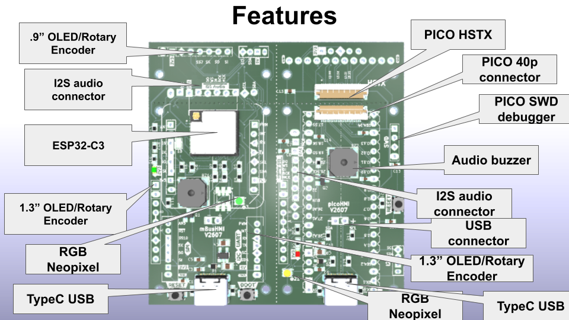

##mBusHMI

The mBusHMI Dev Board repository at GitHub
This project is derived from mBusC3mini V2605, change JST 1mm connectors to 2.0mm, and add PICO 40p connector.

 

---

---
[mBusC3mini V2605 Brief.pdf] (https://github.com/jmysu/mBusC3mini/blob/main/mBusC3mini%20V2605%20Brief.pdf)   
