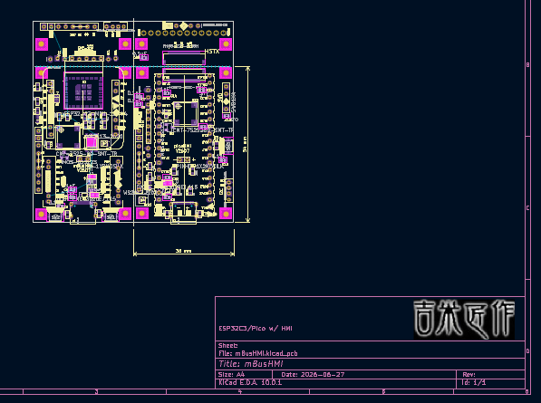

mBusHMI hardware folder
---
Provide the PCB design files V2607(schematic/PCB layout) with KiCad10 format. 

As Autodesk stop the EAGLE PCB supporting and move to the cloud Fusion360,  
I choose the KiCad for faster PCB 3d renderning and circuit documentation.  

 
